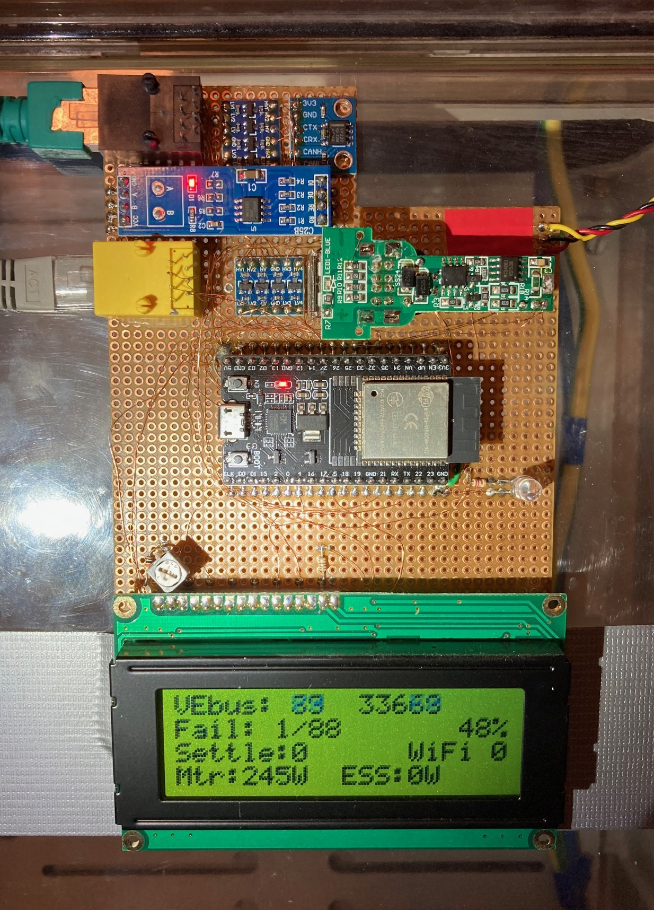

# Victron Multiplus 2 ESS using ESP32 controlling VE.Bus

Implements an ESS system with Victron Multiplus II and Pylontech batteries.
Instead by a Cerbo GX, the Multiplus is directly controlled by the ESP32 via
the VE.Bus.

## Description

This ESS control code works for two famous Multiplus II wiring configurations:
For systems where the Multiplus is only connected with ACin, as well as for
systems with emergency power where the Multiplus is connected to ACin and
ACout2.

In ACout2 configuration, input from an elecric meter might not even be
required, as the ESS assistant inside the Multiplus will automatically
compensate energy on ACout2 from/into the battery to always maintain 0W power
at ACin if possible. Assuming it gets periodic 0W commands from this code via
the [VE.Bus](#vebus).

Input from an electric meter is needed if power is also sourced (or feed-in)
in front of the Multiplus device, meaning in parallel to ACin or connected to
other electrical phases, if one whishes to also compensate this energy to let
a totalizing power meter show zero.

In a conventional ESS system an additional electric meter is required to be
installed. This code can use the optical 1/10000kWh impulse output that most
official digital meters already have.

Note that currently this code only supports a single Multiplus device (single-
phase). In the future it might be extended to also control a three-phase
Multiplus system. If interested in this, read [here](docs/README.md#improvement).

## VE.Bus

For hardware details read my documentation [here](docs/README.md#max485-converter-for-vebus).

For software details read my documentation [here](docs/README.md#vebus).

## Getting Started

### Dependencies

Currently there are no additional dependencies. All used libraries are
included in the Arduino IDE. The author was using Arduino IDE version 2.2.1 on
Windows 10 to compile this code.

### Installing

* Build your hardware according to the [Hardware documentation](docs/README.md#hardware).
* Update your Victron Multiplus II to latest firmare using an MK3 interface. (I am using v502 on my Multiplus II 48/5000).
* Configure your Multiplus with ESS assistant and correct voltage thresholds etc. matching your battery.
* Create Arduino project with _esp32ess.ino_ from _/src_ folder.
* Add file _my_wifi_pw.h_ into your Arduino project directory and edit this file with your WiFi credentials.
* Compile and upload this code onto your ESP32 hardware

## Authors

Contributors names and contact info

Baxi (pv-baxi@gmx.de)

## Version History

* 0.1
    * Initial Release

## License

This project is licensed under the GNU General Public License v3.0 or later - see the LICENSE.md file for details

## Acknowledgments

* [VictronEnergy] (https://www.victronenergy.com/upload/documents/Technical-Information-Interfacing-with-VE-Bus-products-MK2-Protocol-3-14.pdf)
* [wkirby] (https://community.victronenergy.com/questions/64847/rj45-wires-used-by-vebus-pin-out.html)
* [ASCIIart] (https://patorjk.com/software/taag/#p=display&f=Standard&t=)
* [LiquidCrystal] (https://github.com/arduino-libraries/LiquidCrystal)
* [WebServer] (https://github.com/espressif/arduino-esp32/tree/master/libraries/WebServer)
* [ESPmDNS] (https://github.com/espressif/arduino-esp32/tree/master/libraries/ESPmDNS)
* [TWAI] (https://github.com/espressif/arduino-esp32/tree/master/libraries/ESP32/examples/TWAI)
* [Civilduino] (https://github.com/espressif/arduino-esp32/issues/3921)

