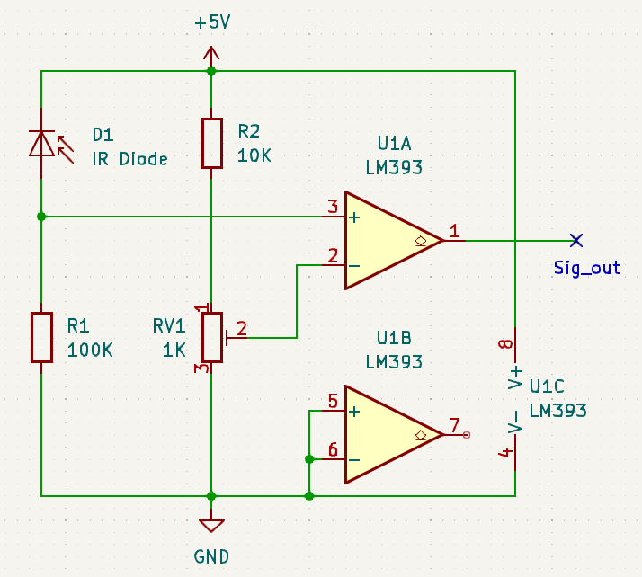

# ESP32ESS documentation

## Hardware

The hardware for this project was built using the following components:
* ESP32-DevKitC V4 (ESP32-WROOM-32D)
* MAX485 converter (resistors R5, R6, R7 removed)
* SN65HVD230 CAN bus transceiver
* LC Display 4x20 HD44780
* Optical impulse receiver circuit
* red LED (with 270 Ohm resistor)
* 2x RJ45 sockets and network cables (for VE.Bus and battery CAN)
* 5V USB power supply with Micro-USB cable (700mA is enough)

### ESP32-DevKitC V4

V4 DevKit was used due to the improved WiFi antenna. But other ESP32 boards will surely work as well.

### MAX485 converter for VE.Bus

The Victron VE.Bus is basically a RS485 bus. To control it, for example a
MAX485 converter circuit can be used. However, in contrary to RS485, the bus
needs to be high impedance >100kOhm, otherwise the connected Victron device
will turn off. To achieve that, the following resistors need to be removed
from a convential RS485 transceiver circuit:
* remove the 120 Ohm resistor between A(D+) and B(D-) pins
* remove any resistor from pins A & B (D+/-) towards Vcc or Gnd

The MAX485 circuit is connected to the ESP32 using the following three pins: DI, DE+RE(connected), RO. These pins are routed to the ESP32 through bidirectional level translators. For current pin assignment, please see "Constants"-section of the source code.

Pinout on the RJ45 socket towards the Multiplus VE.Bus is as follows. Only pins 4 & 5 need to be connected, leave the other pins open: 
* (Pin 1 = lowermost in my [photo](esp32ess_control_board.jpg))
* Pin 4 = A = D+
* Pin 5 = B = D-

The complete pin assignment is provided by Victron on page 2 of the following [schematic](https://github.com/victronenergy/venusgx-hardware/blob/master/VE_BBB_Cape_v0.80_released.pdf).

### SN65HVD230 CAN bus transceiver

In my hardware I'm using the Texas Instruments SN65HVD230 CAN bus transceiver, which has officially to be powered with 3.3V, nicely matching the operating voltage of the ESP32.

However, it took me quite some time to find out, that my cheap SN65HVD230 was a fake IC. With 3.3V operating voltage it's already able to read/sniff CAN bus messages, but it's not able to acknowledge them. Without acknowledgment, our battery will not send the desired 0x355 message with the charge level.

For me it helped to power my fake SN65HVD230 with 5.0V instead and connect both CTX and CRX pins to the ESP32 using a bidirectional level translator circuit. Then it was "magically" starting to acknowledge messages and everything suddently worked as desired.

Pinout on the RJ45 socket towards the Pylontech battery is as follows:
* (Pin 1 = lowermost in my [photo](esp32ess_control_board.jpg))
* Pin 4 = CAN_H
* Pin 5 = CAN_L

### LC Display 4x20 HD44780

As I like those ASCII displays from my past, and they are easily accessible from trashed electronics, I've used one in my hardware. It's connected to the ESP32 in parallel 4-bit mode via pins RS, EN, D4..D7. The pins RW and the contrast voltage I've hardwired to Vss (Gnd). The display needs 5V. But as it only works in receive-mode (RW=0) and is able to handle the 3.3V levels correctly, I didn't use level converters.

For current pin assignment, please see "Constants"-section of the source code. The backlight I also connected to 5V via a 100 Ohm resistor.

### Optical impulse receiver circuit

For receiving the infrared 1/10000kWh impulses from my power meter, I build a small circuit based on the LM393 comperator IC. Note the the IR diode is actually a **transmitter** diode from an old remote control. All my available reveiver diodes didn't work due to the wrong wavelength of the grey filter plastics. But in my experiments I noticed that a transmitter diode (with shiny plastics) also works nicely as receiver.

Please find the circuit below (also avalable as [KiCad Schematic](optical_circuit.kicad_sch)):

Here a photo of my implementation mounted in front of my power meter:

## VE.Bus

On the software side the VE.Bus is a normal asynchronous serial bus with the following settings:
- 256000 baud
- 8 data bits, one stopbit (8N1)
- no parity
- no flow control

Besides communication, one main purpose of the VE.Bus is to provide time
synchronization between all connected devices, for example to synchronize all
three phases in an AC system. For that reason, the Multiplus sends a
synchronization frame every 20ms (=50Hz AC frequency in Europe). Any data needs to be sent
at exact time positions between two synchronization frames.

### VE.Bus send frames

For sending the desired ESS power towards the Multiplus, I'm using command 0x37 (CommandWriteViaID). This command is described on higher level (as MK3 interface command) in the [Victron manual](https://www.victronenergy.com/upload/documents/Technical-Information-Interfacing-with-VE-Bus-products-MK2-Protocol-3-14.pdf).

In chapter 7.3.11 the description starts with the 0x37 command ID. The bytes to be sent before I found out by sniffing the data between the MK3 interface and the Multiplus when running VEConnect software. Here an example of the full command in HEX format:

98 F7 FE XX 00 E6 **37** 02 83 LO HI YY FF
* 98 F7   = device address (from MK3 interface?)
* FE      = differentiates between a data frame (0xFE) and a synchronization frame (0xFD)
* XX      = frame number as increasing counter wrapping between 0 and 127. In our command, it has to match the last frame number send/received over the VE.Bus plus +1. If this number is not correct, the command will be ignored by the Multiplus.
* 00 E6   = two-bytes number, which can be self-defined within some boundaries. It is repeated by the Multiplus in its acknowledgment responses. With that we can find out if the the Multiplus is answering to our own command.
* 37      = CommandWriteViaID
* 02      = flags according to MK3 manual: 0x02 = RAMvar and no EEPROM storage
* 83      = ID, address of ESS power value in assistant memory
* LO HI   = Desired 16 bit integer ESS power value. (Low byte first.) Negative ESS power values mean charging the battery and positive ESS power values mean feeding power into the grid.
* YY      = Checksum
* FF      = End Of Frame character

Note that the command cannot be sent just like this. Before sending out, byte-replacement needs to be done and then the checksum needs to be calculated.

#### Byte replacement

After the pure VE.Bus commmand has been assembled, this function searches through the command bytes following the frame number and replaces bytes between 0xFA and 0xFF with the following two-bytes sequences:
* 0xFA -> 0xFA 0x7A
* 0xFB -> 0xFA 0x7B
* 0xFC -> 0xFA 0x7C
* 0xFD -> 0xFA 0x7D
* 0xFE -> 0xFA 0x7E
* 0xFF -> 0xFA 0x7F

#### Checksum calculation

After the command has been assembled and 0xFA..FF has been replaced, a checksum needs to be added. The checksum is 8 bit and for a frame of N bytes from 0..(N-1) it is calculated as:

0xYY = 1 - b[2] - b[3] - b[4] - ... - b[N-2] - b[N-1]

Like all the other data, it's not allowed to be between 0xFA and 0xFF. So in case of such result, an 0xFA is inserted in front of the checksum and also included into the checksum calculation. Finally the "End Of Frame" character 0xFF is appended to the command. Then it's ready to be send out.

### VE.Bus receive frames

The function _multiplusCommandHandling()_ is looking for the following frames to be received from the Multiplus:

#### Sync frame, sent by Multiplus every 20ms (50Hz)

Example:   
83 83 FD 02 55 51 18 02 97 FF
 * 83 83 = device address (from Multiplus?)
 * FD    = sync frame
 * 02    = frame number (0..127), increases on every frame
 * 55    = "special" character (= 01010101 binary) indicating the sync frame
 * 51    = unknown, maybe device status?
 * 18 02 = 16 bit time stamp, unit = ~0.09ms = ~90µs, b[7]=MSB, b[6]=LSB
 * 97    = Checksum. Special is that b[4]=0x55 is excluded from calculation
 * FF    = End Of Frame character

As soon as a sync frame is received, function _multiplusCommandHandling()_ reads the frame number, increases it by one and is ready to send out the ESS command if desired.

#### Acknowledge frame for ESS 0x37 command

Example:   
83 83 FE 3C 00 E6 87 5A FF
 * 83 83 = device address (from Multiplus?)
 * FE    = data frame
 * 3C    = frame number (0..127), increases on every frame
 * 00 E6 = our own ID defined in prepareESScommand() function
 * 87    = Response as defined in Victron manual for CommandWriteViaID:
   - 0x80 = Command not supported
   - 0x87 = Write ramvar OK
   - 0x88 = Write setting OK
   - 0x9B = Access level required
 * 5A    = Checksum
 * FF    = End Of Frame character
  
When _multiplusCommandHandling()_ receives a successful acknowledge frame, it checks if it was in time and if yes, counts the ESS command as acknowledged.

### Other sniffed VE.Bus frames

#### E4 command

Example:   
83 83 FE 03 E4 80 50 C3 40 0D 03 00 0E 00 00 00 A8 09 00 7A FF
  * 83 83 : device address, 0x8383 = Multiplus, 0x98f7 = MK3 Interface
  * FE    : 0xfd = sync word; 0xfe = data word
  * 03    : frame counter. Increases by 1 on every word, independent of sync or data
  * E4    : command identifier (here 0xe4)
  * 80 50 C3 40 : **still unknown**
  * 0D 03 : 16 bit time stamp 1 = ~0.09ms = ~90µs, b[10]=MSB, b[9]=LSB
  * 00 0E 00 00 00 A8 09 00 : **still unknown**
  * 7A    : 8bit checksum. Following bytes are excluded: b[0..1]=0x8383, b[20]=0xff
  * FF    : End Of Frame character

## Improvements

### Make _multiplusCommandHandling()_ an ISR

The function _multiplusCommandHandling()_ should actually be an interrupt service routine (ISR). Because then it could react on commands, especially the sync frame exactly in time.

The 50Hz sync frame basically gives the pace on the bus and is probably for synchronizing all Multiplus devices in a three-phase AC system. The sync frame should never be disturbed by other frames. Data frames, like our ESS command have to be within specific time slots between two sync frames. This can be seen when sniffing the bus with a logic analyzer. As we are currently executing this function from the main loop whenever we have time, we're evaluating the sync command behind schedule, undefined in time. Thus when we send out our ESS command as reaction on the sync frame, it's luck if the timing was right or wrong. That's why I experience about 1% to 2% of failed ESS commands that never get acknowledged.

As we re-send on a fail, this is currently not a huge problem. However, with this design flaw I would never risk controlling a three-phase Multiplus system, even though this would probably be possible. Of course I tried putting this function into an ISR when writing this code. But probably due to lack of my programming skills this never worked. The code was crashing whenever I had a Serial1.xxxx() function within the ISR. If somebody would be able to put this code into an ISR, this would be an enormous improvement and would surely also make the failed ESS commands disappear.

### Power ESP32 control circuit from Multiplus standby power

Below is the full pinout of the VE.Bus RJ45 connector:
   * pin 1 = n.c./VEN_Gnd
   * pin 2 = Vin+
   * pin 3 = MK3_Gnd
   * pin 4 = A = D+
   * pin 5 = B = D-
   * pin 6 = Standby (always +3.30V, independent if Multiplus is turned on or off)
   * pin 7 = PanelDetect (+3.30V when Multiplus is turned off. Increases to +3.93V when Multiplus is turned on. 
Stays always on +3.9V, also during communication with MK3 interface.)
   * pin 8 = n.c.

I did not measure yet how much power the Standby pin can actually deliver. If it is >200mA, one could imagine using it to power our full ESP32 control circuit. Of course this would require that all components are 3.3V capable. The SN65HVD230 CAN transceiver, if it is not a counterfeit part like mine, is already capable. Similar devices from TI also exist for the RS485/VE.Bus interface. Finally also a 3.3V capable display would be needed. One could switch to a modern OLED display (like AHOY/OpenDTU) or some HD44780 displays that are also working with 3.3V. But then probably a negative voltage needs to be applied on the contrast voltage pin. (I once used a AA battery for that, as is basically sources no current.)

Benefits would be:
* no level translators required anymore
* no external power supply required anymore (also resulting in minor power savings)
* no problem with "black start" during blackout, as all is powered from battery
